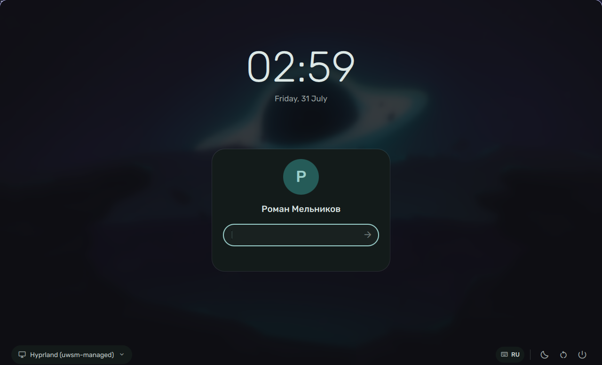
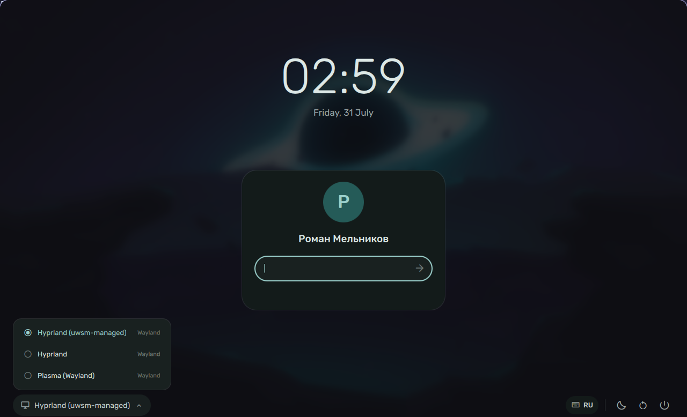

# quickgreet

A [greetd](https://sr.ht/~kennylevinsen/greetd/) greeter built on
[Quickshell](https://quickshell.org), styled after Material 3.



[](#status)
[](LICENSE)


Colours are read from a Material You scheme, so the login screen matches
the desktop it leads into — generate one from your own wallpaper, or drop
in the scheme your shell already produces.

**Authentication is a full PAM conversation**, not a single password
exchange. Second factors, expired-password changes and PAM's own messages
all work, because every prompt PAM sends is shown and answered rather than
assumed away.

- Wallpaper background with configurable blur and dimming
- Session picker, per-user avatars, real names from GECOS
- Live keyboard layout and Caps Lock indicators — and it says `--` rather
  than guessing when the compositor will not tell it
- Suspend, restart and shut down
- Fully operable from the keyboard, because a login screen has to be
- Fifteen languages, one object per language

<details>
<summary>Session picker</summary>



</details>

## Status

**Beta.** It works, and it has been reviewed harder than it has been used.
This is a login screen, so it is worth being precise about which of those
applies to what.

Verified by hand on one machine: rendering, PAM authentication, session
selection, handing over to a Plasma session, keyboard-only operation,
the layout and Caps Lock indicators.

Verified only against a simulated greetd: second factors, expired-password
changes, informational and error prompts, timeouts, a dropped connection.
The scenarios are in `MOCK_SCENARIO` and reproduce the exact message kinds
involved, but no real PAM stack has driven them yet.

Not verified at all: anything on a distribution other than Arch, any
compositor other than Hyprland, more than one user account, more than one
monitor.

**Bugs are very welcome** — especially the boring ones. A greeter fails in
places nobody can screenshot, so a report that says "black screen after
the password, here is `/var/log/quickgreet.log`" is worth more than it
looks. If it left you unable to log in, say so plainly and it goes to the
front of the queue.

Before switching your display manager over, read
[Switching over](#switching-over) and test on a spare VT. That procedure
exists so that a bug here costs you a reboot, not an afternoon.

## Requirements

- `greetd`
- `quickshell` — the git build; tagged releases are too old
- [`quickmotion`](https://github.com/Neftedollar/quickmotion) — the motion module
- `python3` — for the protocol bridge and the session/user enumerators
- `Hyprland` — as the greeter's compositor (see [Why Hyprland](#why-hyprland))
- Fonts: **Rubik** and **Material Symbols Rounded**

On Arch:

```sh
pacman -S greetd hyprland python
yay -S quickshell-git ttf-material-symbols-variable ttf-rubik-vf
```

## Install

```sh
git clone https://github.com/Neftedollar/quickgreet
cd quickgreet
sudo ./install.sh
```

This installs the QML to `/usr/share/quickgreet`, the helper scripts to
`/usr/lib/quickgreet`, and an example configuration to `/etc/quickgreet`.
It does **not** switch your display manager — see below.

### Switching over

Point greetd at the greeter:

```toml
# /etc/greetd/config.toml
[terminal]
vt = 1

[default_session]
command = "/usr/lib/quickgreet/run-greeter.sh"
user = "greeter"
```

Then swap display managers:

```sh
sudo systemctl disable --now sddm      # or gdm, plasmalogin, ...
sudo systemctl enable --now greetd
```

**Test before you commit to this.** A broken greeter means no graphical
login. Run greetd on a spare VT first, with your current display manager
still in charge:

```sh
sudo cp /etc/quickgreet/greetd-test.toml /tmp/
sudo greetd --config /tmp/greetd-test.toml   # binds vt 7
```

Switch to it with `Ctrl+Alt+F7` and log in for real. If that works, make it
permanent. Make sure your console keymap can type your password —
`KEYMAP=` in `/etc/vconsole.conf` — or recovery from a text console will be
impossible.

## Configuration

`/etc/quickgreet/config.json`, every key optional:

| Key | Default | Meaning |
|---|---|---|
| `locale` | `"auto"` | a language code, or `auto` to follow the system |
| `wallpaper` | `""` | Background image; empty means a solid colour |
| `blur` | `0.85` | Background blur, 0–1 |
| `dim` | `0.72` | Background dimming, 0–1 |
| `schemePath` | `/etc/quickgreet/scheme.json` | Colour scheme |
| `defaultSession` | `""` | Session id preselected, e.g. `hyprland` |
| `defaultUser` | `""` | Username preselected |
| `showPowerButtons` | `true` | Show suspend/reboot/shutdown |
| `timeFormat` | `"HH:mm"` | Qt time format |
| `dateFormat` | `"dddd, d MMMM"` | Qt date format |
| `fontFamily` | `"Rubik"` | UI font |
| `iconFontFamily` | `"Material Symbols Rounded"` | icon font |
| `timeoutSeconds` | `60` | how long to wait for greetd before giving up |

Languages: `en`, `ru`, `uk`, `de`, `fr`, `es`, `it`, `pt`, `pl`, `cs`, `nl`,
`tr`, `sv`, `zh`, `ja`. Adding one is a single object in `qml/Strings.qml`;
missing keys fall back to English, so partial translations are fine.

`wallpaper` must be a local path. Remote URLs are refused: a greeter that
fetches over the network announces every boot to whoever hosts the image,
before anyone has authenticated.

### Colours

`scheme.json` uses the Material You shape:

```json
{
  "mode": "dark",
  "colours": {
    "background": "101418",
    "onSurface": "e0e2e8",
    "primary": "a3c9e9"
  }
}
```

Keys may be prefixed with `#` or not. Anything absent falls back to a
built-in neutral palette, so a partial file is fine.

`scripts/gen-scheme.py` builds one from an image, so the login screen can
be derived from its own wallpaper:

```sh
sudo /usr/lib/quickgreet/gen-scheme.py /etc/quickgreet/wallpaper.jpg \
     > /etc/quickgreet/scheme.json

gen-scheme.py --light --variant vibrant image.png   # other options
```

Variants: `tonalspot` (default), `vibrant`, `expressive`, `fidelity`,
`content`, `monochrome`, `neutral`, `rainbow`, `fruitsalad`. Needs
`python-materialyoucolor` and `python-pillow`; both are optional
dependencies, everything else works without them.

The format is the same shape
[caelestia](https://github.com/caelestia-dots/shell) generates, so its
schemes can be dropped in directly:

```sh
sudo cp ~/.local/state/caelestia/scheme.json /etc/quickgreet/scheme.json
```

Note that its seed colour selection differs from `gen-scheme.py`, so the
same wallpaper can yield noticeably different palettes. quickgreet is not
affiliated with that project and does not depend on it.

### Avatars

Looked up in order, first readable wins:

```
/var/lib/AccountsService/icons/$USER
/var/lib/kdm/faces/$USER.face.icon
```

Home directories are deliberately not searched. The greeter decodes
whatever it finds, before anyone has authenticated, in the process that
holds the greetd socket — so a file under a user's own control there is an
image decoder any unprivileged account can reach pre-authentication, with
a decompression bomb or a codec bug. Without a system-wide avatar, the
account's initial is drawn instead.

## Development

```sh
./test.sh                        # mock mode, password "test"
./test.sh -k                     # stop it
MOCK_SCENARIO=2fa ./test.sh      # a different conversation
python3 -m unittest discover tests
```

Mock mode runs the full UI and the entire protocol state machine against a
simulated greetd, in an ordinary window inside your current session. No
authentication happens and nobody is logged in.

`MOCK_SCENARIO` picks what the mock plays back. A plain success exercises
almost nothing, and every deadlock found in review lived in a message kind
the mock could not produce:

| | |
|---|---|
| `normal` | password, then success |
| `2fa` | password, then a visible code prompt (any 6 digits) |
| `expired` | password, then two prompts for a new one |
| `info` | an informational message before the password |
| `lockout` | an error message, the kind that used to wedge the greeter |
| `hang` | no reply at all, to exercise the timeout |

The tests cover protocol framing, `.desktop` parsing and account
filtering — everything that needs neither a compositor nor greetd. Standard
library only; nothing to install.

Drop a `config/config.dev.json` in the checkout to point at your own
wallpaper and scheme; it is gitignored and takes precedence over the
example.

### Why Hyprland

The keyboard layout belongs to the compositor and no Wayland client can
read or change it on its own. Under Hyprland the greeter subscribes to the
event socket for live layout updates and switches via `hyprctl`.

Everything else works under any compositor — `QUICKGREET_COMPOSITOR`
selects one — but the layout badge then reads `--` and does not respond to
clicks, because it has nothing to report. It deliberately does not guess:
an indicator that confidently shows the wrong layout on a login screen is
worse than no indicator at all. Set `QUICKGREET_LAYOUTS` to a comma-
separated list to opt into tracking Alt+Shift presses instead, accepting
that it is inference.

### Layout

```
qml/      shell.qml and components; this is the Quickshell config root
scripts/  greetd bridge, session and user enumerators, greeter launcher
config/   example config, greetd and Hyprland samples
contrib/  PKGBUILD, polkit rules
tests/    unittest suite for the scripts
```

### Packaging

`install.sh` honours `DESTDIR`, `PREFIX` and `SYSCONFDIR`, so a package
can call it rather than reimplementing the layout:

```sh
DESTDIR="$pkgdir" ./install.sh
```

`QUICKGREET_COMPOSITOR` overrides the compositor the launcher starts, for
anyone not using Hyprland.

## Notes

**X11 sessions** are not listed by default. greetd runs the session
command on a bare VT with no X server, so an `xsessions` entry fails
invisibly and bounces back to the greeter — on screen, indistinguishable
from a wrong password. Pass `--include-x11` to `list-sessions.py` if your
entries are wrapped in `startx` or similar.

**Power buttons** call `loginctl`, which both systemd and elogind provide.
The greeter's user usually has polkit permission already; if the buttons do
nothing, install `contrib/polkit/10-quickgreet-power.rules`. That rule
deliberately does not grant the `*-multiple-sessions` actions: those cover
the case where other people are still logged in, and being asked to
authenticate there is the point.

**greetd framing** is a 4-byte native-endian length followed by JSON.
Quickshell's `Socket` splits on delimiters and cannot read that, which is
why `scripts/greetd-bridge.py` exists: line-delimited JSON on one side,
greetd's framing on the other.

**Two cursors**, one lagging behind the other, mean a cursor theme is
named but not installed — the compositor falls back to a built-in pointer
while clients keep drawing their own. `run-greeter.sh` picks a theme that
actually exists on the machine, which is why greetd runs it rather than
Hyprland directly. If you see this inside your *desktop* session, check
whatever sets `XCURSOR_THEME` there against `ls /usr/share/icons/*/cursors`.

**Testing while already logged in** has limits worth knowing before you
blame the greeter. The test VT must be genuinely free — `loginctl
list-sessions` shows which are taken — or logind refuses the login with
`VirtualTerminalAlreadyTaken` and greetd simply restarts the greeter,
which looks exactly like a rejected password. Starting a *second*
concurrent session for a user who is already logged in also fails with
session managers that use systemd user units, `uwsm` among them; pick the
plain compositor session from the dropdown for that test. Neither applies
at a real boot.

## Licence

MIT. See [LICENSE](LICENSE).
